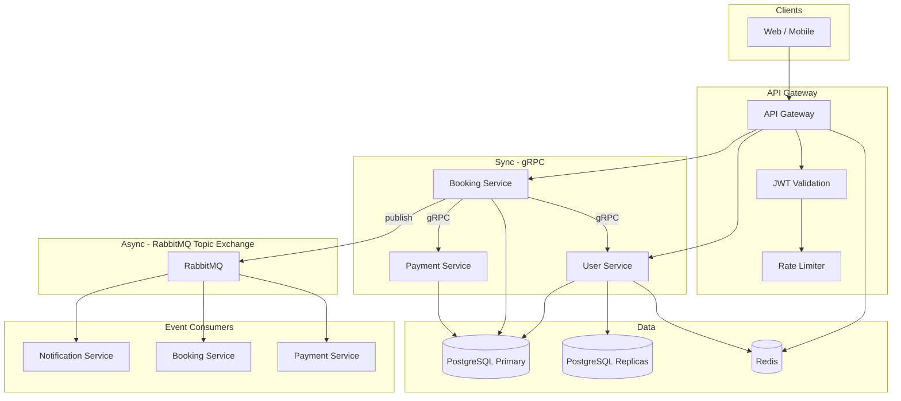

# High-Scale Microservice Architecture: Book-a-User (Hangout) Platform

**Target:** 10M requests/day (~115 RPS average, ~575 RPS peak). User-to-user booking (book another user for hangout, hotel-style). No separate Friend service.

---

## 1. High-Level Architecture Diagram



---

## 2. Communication Rules

| From → To        | Protocol   | When |
|------------------|------------|------|
| Gateway → *      | HTTP/REST  | Client requests |
| Booking → User   | gRPC       | Get host user (price_per_hour), balance, KYC |
| Booking → Payment| gRPC       | Deduct balance (Saga step) |
| Booking → RabbitMQ | Publish | booking.created, booking.confirmed, booking.failed, booking.cancelled |
| Payment → RabbitMQ | Publish | payment.completed, payment.failed |
| * → Notification | RabbitMQ   | Consume events, push/email/WS |
| Chat             | WebSocket + Redis Pub/Sub | Real-time messages |

**RabbitMQ:** Topic exchange `booking_events` with routing keys: `booking.created`, `booking.confirmed`, `booking.failed`, `booking.cancelled`, `payment.completed`, `payment.failed`.

---

## 3. Folder Structure (Monorepo)

```
yobae-backend/
├── apps/
│   ├── api-gateway/           # JWT, rate limit, route to services
│   │   ├── src/
│   │   │   ├── main.ts
│   │   │   ├── gateway.module.ts
│   │   │   ├── auth/          # JWT guard, strategy
│   │   │   ├── rate-limit/    # throttling (Redis)
│   │   │   ├── users/
│   │   │   ├── bookings/
│   │   │   ├── payments/
│   │   │   └── health/
│   │   └── Dockerfile
│   ├── users-service/         # gRPC, Postgres + replicas, Redis cache
│   ├── bookings-service/     # gRPC client to User + Payment, RMQ publisher, Saga (book user for hangout)
│   ├── payment-service/      # gRPC, balance, refunds, Saga participant
│   ├── notifications-service/# RMQ consumer, push/email/WebSocket
│   └── chats-service/        # WebSocket, Redis pub/sub, message store
├── shared/
│   ├── proto/                # .proto files + generated interfaces
│   ├── events/               # RabbitMQ event payloads, exchange/routing keys
│   ├── dto/
│   └── constants/
├── docker-compose.yml
├── docker-compose.prod.yml
└── docs/
    └── ARCHITECTURE.md
```

---

## 4. Database Design (PostgreSQL)

### 4.1 Schema (per-service DB or shared; below is logical schema)

**users** (User Service)
- id (PK), email (unique), password_hash, name, gender, balance (decimal), kyc_status (enum), price_per_hour (decimal, nullable; set for users who can be booked), created_at, updated_at
- Indexes: email, kyc_status, (id) PK

**bookings** (Booking Service)
- id (PK), user_id (booker), host_id (user being booked), start_at, end_at, idempotency_key (unique), status (pending | confirmed | failed | cancelled), amount (decimal), created_at, updated_at
- Unique (host_id, start_at) to prevent double booking
- Indexes: idempotency_key (unique), user_id, host_id, status, created_at

**payments** (Payment Service)
- id (PK), booking_id, user_id, amount, type (deduct | refund), status (pending | completed | failed), idempotency_key (unique), created_at
- Indexes: booking_id, user_id, idempotency_key (unique)

**transactions** (Payment Service – audit log)
- id (PK), user_id, amount (signed), type, reference_id (booking_id/payment_id), created_at
- Indexes: user_id, reference_id, created_at

**messages** (Chat Service)
- id (PK), conversation_id, sender_id (user_id), content (text), created_at
- Indexes: conversation_id, created_at

**conversations** (Chat Service)
- id (PK), booking_id (FK), user_id (booker), host_id (user booked), created_at
- Indexes: booking_id, user_id, host_id

---

## 5. Caching Strategy

| What to cache           | TTL    | Invalidation |
|-------------------------|--------|--------------|
| Users available for hangout (paginated) | 5 min  | On user profile update; cache key includes page/sort |
| User profile by ID (for booking)        | 2 min  | On profile update |
| User session            | 24 h   | On logout / token revoke |
| Rate limit counters     | Per window (e.g. 1 min) | Sliding window in Redis |
| Host’s booked slots (for UI) | 1 min | On booking create/cancel |

**Cache stampede:** Use single-flight (e.g. Redis GET + SET NX with short lock) or probabilistic early expiry (e.g. recompute at TTL * random(0.8, 1.0)).

---

## 6. Booking Flow (Saga – Choreography)

1. **Client** → API Gateway → **Booking Service** (CreateBooking: booker userId, hostId, startAt, endAt, **idempotency_key**).
2. **Booking Service:**
   - Check idempotency: if key seen → return stored response (idempotent).
   - **gRPC User Service:** Get host by id (FindById); read `price_per_hour`. Compute amount = duration × price_per_hour.
   - **gRPC Payment Service:** Deduct balance (with same idempotency_key). If failed → emit `booking.failed`.
   - On payment success: persist booking (user_id, host_id, start_at, end_at, amount), emit **booking.confirmed** and **payment.completed**.
3. **Payment Service:** On deduct: debit user balance, insert payment + transaction; idempotent by idempotency_key.
4. **Consumers:** Notification Service subscribes to `booking.confirmed`, `booking.failed`, `booking.cancelled` → send push/email/WebSocket.

**No double booking:** Unique (host_id, start_at) on bookings table; insert fails if slot already taken.

**No double payment:** Idempotency key in payments table; duplicate request returns same result.

---

## 7. Scalability & Performance

- **Peak traffic:** Horizontal scaling of Gateway, Booking, User, Payment (K8s HPA on CPU/RPS). Stateless services.
- **DB overload:** Connection pooling (PgBouncer or app-level pool); read replicas for list/profile reads; write to primary only.
- **N+1:** Use Prisma `include` / batch loaders; avoid per-item queries in loops.
- **Background workers:** Notifications and non-critical tasks via RabbitMQ consumers (scale consumer replicas).
- **Circuit breaker:** On gRPC client to Payment/User (e.g. fail fast after N failures).
- **Retry:** Exponential backoff for transient gRPC/RMQ errors; idempotency keys for booking/payment.
- **DLQ:** Failed RMQ messages after N retries → dead-letter queue for alerting/replay.

---

## 8. Security

- **JWT:** Issued at login (User/Auth service); Gateway validates JWT and forwards user id to services.
- **Rate limiting:** Redis-backed sliding window per user/IP; 429 when exceeded.
- **Input validation:** DTOs with class-validator; sanitize inputs.
- **Race conditions:** Reserve slot in DB with row lock or optimistic lock; single place that updates slot status.
- **Overbooking:** Enforce slot reservation atomically; reject if already reserved.
- **Payment:** Never trust client for amount; Booking gets host’s price_per_hour from User service and passes to Payment; Payment checks balance server-side.

---

## 9. Deployment

- **Docker:** Each service has a Dockerfile; `docker-compose.yml` for local (Postgres, Redis, RabbitMQ, all apps).
- **Kubernetes:** Deployments for each service; HPA (e.g. min 2, max 10, target CPU 70%); Service discovery for gRPC; Ingress for Gateway.
- **PostgreSQL:** Primary + read replicas; connection string for writes vs reads (env vars).
- **RabbitMQ:** Cluster for HA; topic exchange and queues per consumer group.

---

## 10. Deliverables Checklist

- [x] High-level architecture diagram (above)
- [x] Folder structure (see repo: apps/*, shared/*)
- [x] Database schema design (see `docs/DATABASE_SCHEMA.md`)
- [x] Caching strategy
- [x] Booking Saga outline (see `docs/BOOKING_SAGA_IMPLEMENTATION.md`)
- [x] Security & performance notes
- [x] Shared protos (`shared/proto/user.proto` with price_per_hour, `payment.proto`)
- [x] RabbitMQ event contracts (`shared/events/booking.events.ts`)
- [x] Docker Compose (`docker-compose.yml`; apps with `--profile apps`)
- [x] Event publisher (`shared/rabbitmq/booking-events.publisher.ts`) and consumer (`apps/notifications-service/src/booking-events.consumer.ts`)
- [x] Idempotency and Saga implementation in Booking service (`apps/bookings-service/src/bookings-service.service.ts`)
